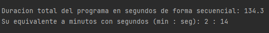
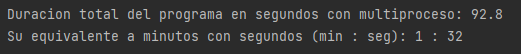

# carasFotogramasVideoAzurePython

## ¿Cuáles librerías fueron utilizadas?
El programa dentro de la carpeta "Scripts" tiene un intérprete de Python el cual maneja todas las librerías utilizadas, en caso de que no se deseen utilizar y se quiere utilizar un interprete propio se requieren las siguientes librerías:

  1. opencv-python
  2. requests
  3. cognitive-face

## ¿Cuál es la funcion del programa?
El programa utiliza el reconocimiento facial de Microsoft Azure mejor conocido como Face API, en este caso, para detectar caras se utilizan videos en formato ".mp4"  que se guardaran en la carpeta “video” para obtener sus fotogramas por medio de una función, luego, son guardados en una carpeta llamada "fotograma" y en una subcarpeta de "fotogramaCara" llamada "temp". Una vez obtenidos esos fotogramas Face API verificara de uno en uno si hay una o múltiples caras, si hay se imprimirán datos en la consola como su edad o emociones, además, dibujara un cuadrado de la o caras detectadas en la imagen y se guardara en la carpeta "fotogramaCara", en caso contrario simplemente dirá que no se encuentra ninguna.

El programa cuenta con dos funciones, la primera es ejecutar el programa en forma secuencial, primero obtendrá los fotogramas del o los videos agregados en la carpeta “video”, una vez obtenidos verificará los fotogramas de uno en uno en búsqueda de caras. La segunda función es ejecutar el programa gracias al multiprocesamiento, esto hará que por cada fotograma que se haya obtenido en el momento pase por la verificación de caras. Cabe aclarar que la velocidad de internet también será responsable de la duración del programa, debido a que cada fotograma se envía a los servidores de Microsoft Azure con Face API para su respectivo análisis.

## ¿Por qué utilizar multiprocesamiento en los programas?
Gracias al multiprocesamiento podemos acortar el tiempo de ejecución de un programa según la situación que se presente, por ejemplo: 

Computadora utilizada:
- Sistema operativo: Windows 10 64 Bits 19043.1288 (21H1)
- RAM: 8 GB
- Procesador: Intel Core i5 4570
- GPU: NVIDIA GT 1030 GDDR5 2 GB
- Disco duro: Teamgroup GX1 SATA 6Gb/s (SSD)

Velocidad de internet:
- Bajada: 30 Mbps
- Subida: 3 Mbps

Cantidad de videos utilizados:
- 2

Características de cada video utilizado:

1.
- Duración: 7:49 (siete minutos con cuarenta y nueve segundos)
- Tamaño: 854 x 480
- Peso: 40.2 MB

2.
- Duración: 9:25 (nueve minutos con veinticinco segundos)
- Tamaño: 854 x 480
- Peso: 59.5 MB

Cuando se ejecutó  el programa en forma secuencial se obtuvieron los siguientes resultados:

Cuando se ejecutó  el programa con el multiprocesamiento se obtuvieron los siguientes resultados:

## ¿Como utilizo el programa?
1. Se debe tener dos cuentas de Microsoft Azure con Face API gratuitas, si solo se posee una se deben hacer los cambios necesarios en el código.
2. Se debe descargar él ".zip" del programa del repositorio.
3. Se debe descomprimir él ".zip".
4. Se debe buscar y abrir con su IDE favorito.
5. Se debe seleccionar el intérprete que se encuentra en la carpeta "Scripts" del programa, en caso contrario se deben descargar las librerias.
6. Agregar los códigos de suscripción y las urls donde se encuentran las variables de Face API al inicio del programa.
7. Iniciar el programa para que genere las carpetas necesarias para ejecutar el programa.
8. Una vez generadas las carpetas se debe agregar a la carpeta "video" al menos un video, todos los videos deben utilizar el formato ".mp4".

## Videos de referencia
- En este primer video explico cómo hacer una cuenta de Microsoft Azure con Face API gratuitamente:
https://youtu.be/tZciSVSpGb8

- En este segundo video explico en forma general el código utilizado:
https://youtu.be/vGPFLiTsKaQ

- En este tercer video explico cómo utilizar el programa en forma general:
https://youtu.be/Y-8xLB0fc_M
